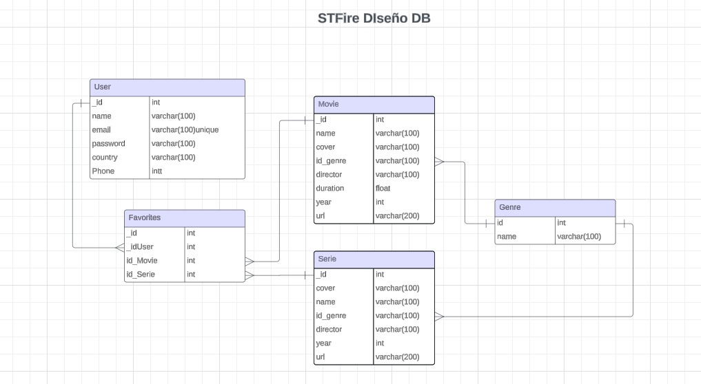
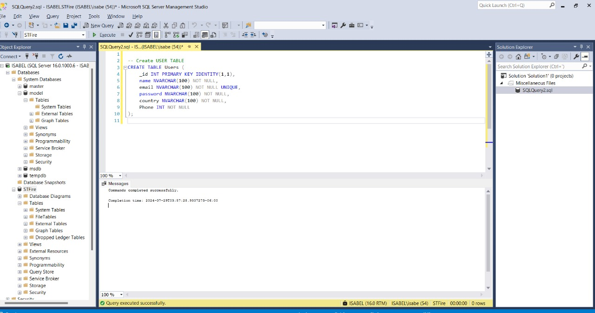
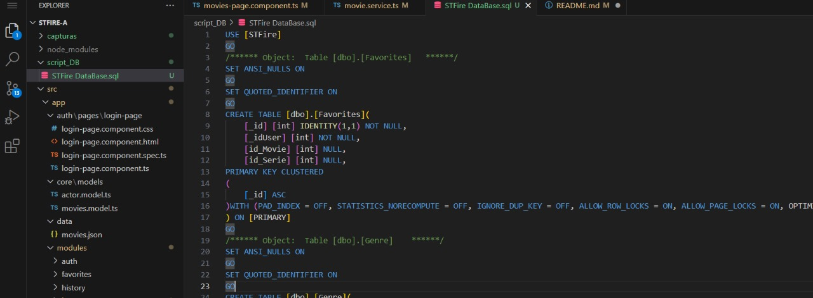
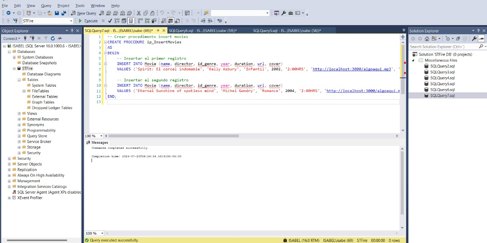
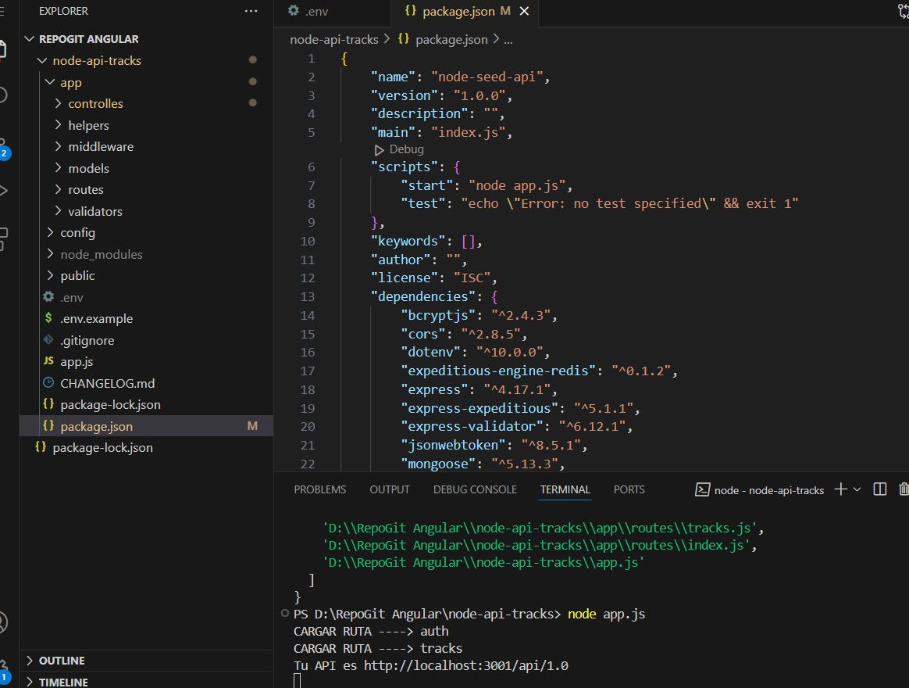
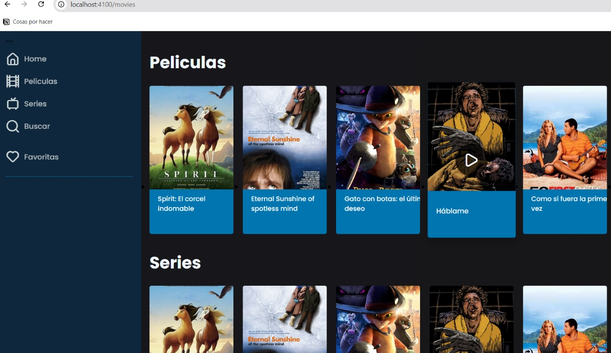
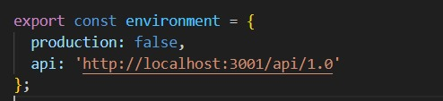

# StfireA

Este es una parte del proyecto desarrollado en angular como una aplicación de entretenimiento. En este sprint se trabaja con la integración de una API y la normalización de una base de datos con MySQL y T-SQL-

*Nombre del proyecto*: StFire
*Nombre de desarrolladora:* Isabel F. Montes
*Usuaria en Discor*: isa_montes2507

---

## Descripción
En el sprint 4, se ha trabajado con la estructura del framework angular para poder crear un sitio de entretenimiento de reproducción de peliculas, en el cuarto sprint se integra la base de datos, asi como la conexión con una api para poder alimentarla. 

## Requerimientos tecnicos

-Angular v.12-2-0
-NodeJS v. 14.17.6
-VS Code
-My SQL Serve(instalación)
-SSMS

## Instalación

1. Clonar repositorio de git
2. Establecer una carpeta 
3. Creación del proyecto
4. npm install
5. Instalación de MySQL Serve 2022 y SSMS 2022

---

## Capturas

Proceso de trabajo:

Diseño de la BD en un  digrama para poder implementarlo por medio de sql. 

Estas son las tablas usadas en esta version para integrarse en el proyecto

Para despues crear nuevas consultas y crear las tablas. 

El Script de dicho trabajo se encuentra dentro del mismo proyecto exportado .sql

Intente agregar algunas funciones y procesos aunque me fue un poco confunso y no resulto del todo

Tome como referencia la API usada en el curso de angular para poder conectar mi proyecto de manera exitosa
y los archivos cargados ahora provienen de dicha API susbcrita a los servcios

Configurando el archivo .enviorement para poder hacer que se conectara y obtuviera la información de manera dinámica fuera del proyecto

## Proceso

Estuve revisando los cursos brindamos para poder integrar las tecnologias al proyecto de angular, y me parecio interesante como se debe tener el seguimiento de separar y hacer escalable el sistema con las APIs. 

Anteriormente había trabajado con el SQL, sin embargo represento un reto comprender y hacer uso de herramientas más complejas para implementar un sistema de manera adecuado con T-SQL y la parte de conectar a los servidores. Así como comprender la funcionalidad de distintas carpetas que brinda angular como .env, que además de las pruebas que se pueden realizar, también ayudan con la conexiones que se realizan. 
## Problemas presentados

- Trabajo con herramienta distinta a la acostumbrada
- Falta de expertis para T-SQL
- Mejora de entedimiento de servidores, buenas practicas 
- Relación de API y base de datos creada 

# Mi Proyecto Angular

## Retrospectiva del Proyecto

| ¿Qué salió bien? | ¿Qué puedo hacer diferente? | ¿Qué no salió bien? |
|------------------|-----------------------------|---------------------|
| Salio bien la instalación de programas y enlaces con la API de prueba de angular | usar mejores practicas de porgramación, tener mayor expertis en la manera de crear y aplicar los procedemientos        | La conexión con el servidor y la implementación completa de las rutas con la base de datos    |
|                  |                             |                     |

