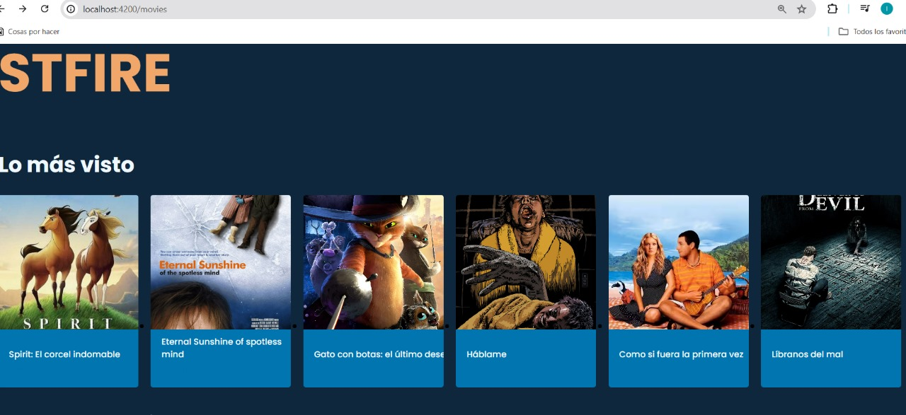
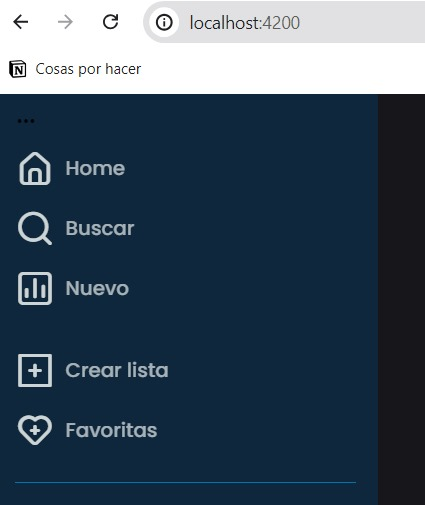
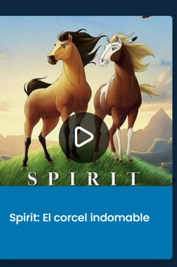
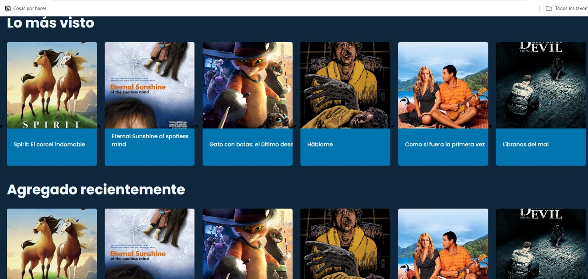

# StfireA

Este es una parte del proyecto desarrollado en angular como una aplicación de entretenimiento.

*Nombre del proyecto*: StFire
*Nombre de desarrolladora:* Isabel F. Montes
*Usuaria en Discor*: isa_montes2507

---

## Descripción
En el sprint 2, se ha trabajado con la estructura del framework angular para poder crear un sitio de entretenimiento de reproducción de peliculas. 

## Requerimientos tecnicos

-Angular v.12-2-0
-NodeJS v. 14.17.6
-VS Code

## Instalación

1. Clonar repositorio de git
2. Establecer una carpeta 
3. Creación del proyecto
4. npm install

---

## Capturas

Este es una imagen general de la primera vista del proyecto con dos secciones principales

Contiene un sidebar para navegación mas simple

Vistas indivuales de las cards con el reproductor de peliculas

Vistas de las dos secciones juntas

## Proceso

Revisando el curso que se nos brindo de angular, pude tomarlo como base de aprendrizaje para realizar el hub de entretenimiento solicitado. Usando herramientas disponibles de otros lenguajes, pude adaptar las manera de mostrar las vistas. 

Al mostrar la información en las sección general se busco la manera de mostrar lo más escencial, el uso de los modulos, rutas dentro de los componentes por medio de las configuraciónes de las mismas me permitio comprender la importancía de los mismos para poder hacer que un sistema tan escalable sea creado desde el principio. 

Los desafios al usar herramientas de angular fueron bastos, pero con la dedicación en el tiempo dado me ha permitido ampliar mi panorama de programación. Así como hacer uso de similes con otros frameworks como laravel para poder entender conceptos usados en angular. 

La cuestión de enrutamiento  y enlace correcto de los modulos es algo en lo que aún estoy trabajando por poder hacer de forma más concistente, eficiente y sin  errores. 

## Problemas presentados

- Instalación de las versiones de angular solicitadas
- Falta de expertis en el desarrollo de proyectos con Angular
- Fallos en la consola cuando se recargaba de manera constante 
- Uso correcto y consistente de enlaces entre modulos y rutas 

# Mi Proyecto Angular

## Retrospectiva del Proyecto

| ¿Qué salió bien? | ¿Qué puedo hacer diferente? | ¿Qué no salió bien? |
|------------------|-----------------------------|---------------------|
| Salio bien la instalación de dependencias en angular para poder crear el poryecto, el uso de tiempo disponible para comprender el framework y el mostrar un poco de la información que el hub debe tebner  | Usar lineamientos de angular y aterrizar la manera en la que información se muestra, asì como estar aprendiendo de nuevas versiones de angular, hacer uso de mejor UX para el proyecto         | En el enrutamiento y el trabajo con diversos modulos para que mostraran la informacióm de manera adecuada. Culminacion de ambos sprints en tiempo    |
|                  |                             |                     |

